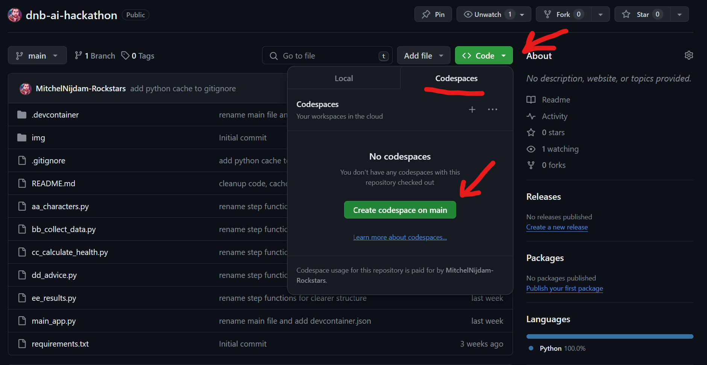

# DNB AI Hackathon

Welcome to the **DNB AI Hackathon**! This repository contains all the code you need to get started.
Let your, uh... the AI's creativity flow and have fun!

## First steps
No need to clone this repository (although you can if you want).

1. Click `Code`, then `Codespaces` and `Create codespace on main`
2. Wait for the codespace to be created
3. You're ready to go!



## Introduction
This repository contains a [Streamlit](https://docs.streamlit.io/) webapp that can be used for the DNB AI hackathon.

Useful to know:

- The main file is `main_app.py`
- Streamlit code is executed from top to bottom on each page refresh or input change
- Are you stuck? Use the branches for checkpoints
- See more information about the assignments in the [assignment document](assignments/assignments.pdf)

## Run Locally (not in codespace)

### Prerequisites
- Python 3.6+
- pip
- virtualenv

### Instructions
To run the app locally, execute the following commands:

```bash
# 1. Create new python virtual environment
python3 -m venv myenv

# 2. Activate the virtual environment
myenv\Scripts\activate # For windows
source myenv/bin/activate #For linux/mac

# 3. Install the required packages
pip install -r requirements.txt

# 4. Run the app
streamlit run main.py
```

